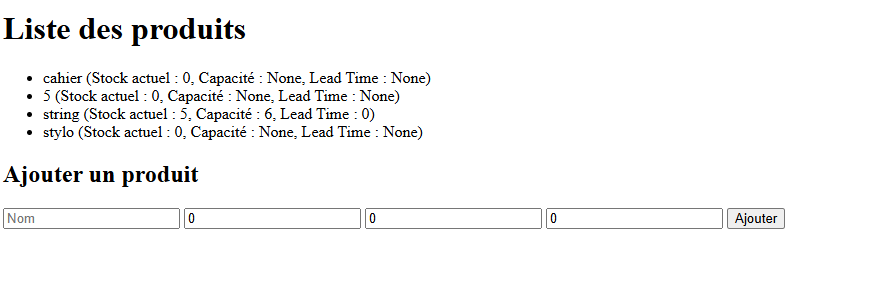

# Gestion de Stock – FastAPI & Prophet

Application web de gestion de stock avec prévision des ventes grâce à Prophet, visualisation des données, recommandations de commandes et gestion de produits.

##  Fonctionnalités principales

- **Gestion des produits** : Ajout, listing, gestion du stock, capacité, délai de livraison
- **Import des ventes** : Upload CSV rapide pour l’historique des ventes
- **Prévisions** : Prédictions des ventes (globale ou par produit) sur 7 ou 30 jours
- **Recommandations** : Quantité à commander en fonction des prévisions, du stock, de la capacité et du délai d’approvisionnement
- **Visualisation** : Graphiques interactifs (Chart.js), export des recommandations en CSV
- **Interface web** : Simple et fonctionnelle, accessible sur navigateur
- Interface interactive avec **Streamlit** pour tester les prévisions sans coder

###  Prérequis

- Python 3.9+  
- PostgreSQL 15+  
- [Docker](https://www.docker.com/) 
- pip

#### Installation

1. Cloner le projet
git clone <https://github.com/Massilia2001/gestion-stock.git>
cd gestion-stock
2. Lancer avec Docker 
docker-compose up --build
Application sur : http://localhost:8000

Docs API : http://localhost:8000/docs

3. Ou installer en local
python -m venv venv
source venv/bin/activate
pip install -r requirements.txt
uvicorn stockapi.main:app --reload
Configure la base PostgreSQL (DATABASE_URL) si besoin dans un .env ou dans stockapi/database.py.

##### Tests unitaires (Pytest)
1. Installation de pytest
pip install pytest

2. Organisation des tests
Placer les fichiers de tests dans le dossier tests/ à la racine du projet .

Exemple d’organisation :

Copier
Modifier
gestion-stock/
├── stockapi/
├── tests/
│   ├── test_prediction.py
│   ├── test_models.py
│   └── ...
└── ...
3. Lancer les tests

pytest
ou pour voir le détail :

pytest -v

###### Utilisation rapide
1. Accueil : /

2. Importer un fichier CSV de ventes : /upload

3. Voir l’historique des ventes : /visualisation

4. Gérer les produits : /products-view

5. Prévisions globales : /predict-view

6. Prévisions par produit : /predict-view?product_id=ID

7. Recommandation d’achat : /recommendation-view?product_id=ID

8. Exporter recommandations CSV : /export-recommendations-csv

 Format attendu pour le CSV
ds	y	product_id
2024-01-01	32	1
2024-01-02	21	1
2024-01-01	12	2
...	...	...

ds : Date (format YYYY-MM-DD)

y : Nombre de ventes

product_id : ID du produit

###### Structure du projet

gestion-stock/
├── stockapi/
│   ├── main.py
│   ├── models.py
│   ├── database.py
│   ├── templates/
│   ├── static/
│   └── ...
├── tests/
│   └── test_*.py
├── requirements.txt
├── docker-compose.yml
├── Dockerfile
├── README.md
└── ...

##### Interface Streamlit 

 Lancement de l'interface interactive sans passer par l'API ou l'HTML.

streamlit run streamlit_app.py

### Technologies utilisées
FastAPI

SQLAlchemy

Prophet (Meta)

PostgreSQL

Jinja2

Chart.js

pytest

Streamlit

Docker & Docker Compose

### Captures d’écran 

### Accueil

### Import de ventes

### Visualisation

### Gestion des produits

### Recommandation intelligente

### Résultats des tests unitaires (Pytest)

> Tous les tests passent avec succès 

---

### Page de prédiction (predict-view)

> Visualisation des prévisions sur 7 ou 30 jours, avec graphique interactif.

---

### Interface interactive FastAPI

> Documentation interactive générée automatiquement avec Swagger UI.

le depot github (https://github.com/Massilia2001/gestion-stock.git)

Projet réalisé par Massilia Oumaza
Contact : massilia.oumaza2001@gmail.com